# SmartBank AI

SmartBank AI is a full-stack digital banking project with customer banking, admin control, OTP login, KYC approval, fraud monitoring, loans, investments, QR payments, and Gemini AI assistant.

## Tech Stack

- Frontend: React, Vite, React Router, Axios, Recharts
- Backend: Spring Boot, Spring Security, JWT, Spring Data JPA
- Database: MySQL
- AI: Google Gemini through Spring AI
- Mail: Gmail SMTP for OTP
- API Docs: Swagger UI

## Project Structure

- `frontend` - React application
- `backend` - Spring Boot REST API
- `database` - SQL schema/reference files
- `docs/screenshots` - frontend screenshots for README

## Main Features

- Public dashboard page
- Customer registration
- Email OTP verification
- JWT login
- Customer KYC submission
- Admin KYC approval/rejection
- Savings account creation after approved KYC
- Dashboard with balance, income, expense, transactions, and risk score
- Deposit, withdraw, transfer, and QR payment in one page
- Download account QR
- Scan receiver QR from gallery/camera
- Transaction ledger with filters
- Fraud alerts and risk score
- Investment risk profile and portfolio analytics
- EMI calculator and loan approval prediction
- Admin analytics
- Customer management
- Enable/disable customer
- Freeze/unfreeze account
- Fraud approval/blocking
- Loan approval/rejection
- Audit logs
- SmartBank AI assistant

## Customer Flow

1. Register customer.
2. Verify OTP.
3. Login with email and password.
4. Verify OTP again.
5. Submit KYC.
6. Wait for admin approval.
7. After approval, dashboard and banking pages unlock.

## Admin Flow

1. Login as admin.
2. Verify OTP.
3. Open Admin Analytics.
4. Approve/reject KYC.
5. Review customers, fraud, loans, and audit logs.
6. Freeze/unfreeze accounts when needed.
7. Disable customer to block login.

## Default Admin

- Email: `dwivediprabhanshu17@gmail.com`
- Password: `Prabhanshu@9981`
- Role: `ADMIN`
- Status: Active

## Database Setup

1. Create MySQL database:

```sql
CREATE DATABASE IF NOT EXISTS smartbank_ai;
```

2. Backend database config:

```text
backend/src/main/resources/application.properties
```

3. Current local database:

```text
Database: smartbank_ai
Username: root
Password: Prabhanshu
Port: 3306
```

4. Tables are created/updated by JPA:

```text
spring.jpa.hibernate.ddl-auto=update
```

## Backend Run

Open backend in IntelliJ and run:

```text
com.smartbankai.SmartBankAiApplication
```

Backend URL:

```text
http://localhost:8099
```

Swagger:

```text
http://localhost:8099/swagger-ui.html
```

Build from terminal:

```bash
cd backend
mvn clean package
```

## Frontend Run

Open frontend in VS Code:

```bash
cd frontend
npm install
npm run dev
```

Frontend URL:

```text
http://localhost:5173
```

Frontend API base URL:

```text
http://localhost:8099/api
```

## OTP Mail

- OTP is sent through Gmail SMTP.
- If email fails, OTP is printed in backend terminal.
- Gmail app password must be 16 characters without spaces.

## AI Assistant

- Gemini is used through Spring AI.
- AI assistant answers about KYC, banking operations, transactions, fraud alerts, loans, investments, and admin workflows.
- If Gemini API fails, backend returns a clear AI configuration/error message.

## Important Rules

- Customers cannot access banking pages before KYC approval.
- Pending KYC customers only see pending status/details.
- Rejected KYC customers can resubmit KYC.
- Disabled customers cannot login.
- Frozen accounts cannot deposit, withdraw, transfer, or use QR payment.
- Admin users are not shown in Customer Management.
- Transaction type uses only `DEPOSIT`, `WITHDRAW`, and `TRANSFER`.
- QR payments are saved as `TRANSFER` with QR payment description.

## Key API Routes

Authentication:

- `POST /api/auth/register`
- `POST /api/auth/login`
- `POST /api/auth/verify-otp`
- `GET /api/auth/profile`

Banking:

- `GET /api/banking/dashboard`
- `POST /api/banking/deposit`
- `POST /api/banking/withdraw`
- `POST /api/banking/transfer`
- `POST /api/banking/qr-payment`
- `GET /api/banking/transactions`
- `GET /api/banking/my-qr`

KYC:

- `POST /api/kyc/submit`
- `GET /api/kyc/me`
- `GET /api/admin/kyc/{status}`
- `POST /api/admin/kyc/{id}/approve`
- `POST /api/admin/kyc/{id}/reject`

Fraud:

- `GET /api/fraud/alerts`
- `GET /api/fraud/user-risk-score`
- `GET /api/admin/fraud-alerts`
- `POST /api/admin/fraud-alerts/{id}/approve`
- `POST /api/admin/fraud-alerts/{id}/block`

Investment:

- `POST /api/investment/risk-profile`
- `GET /api/investment/suggestions`
- `POST /api/investment/add-portfolio`
- `GET /api/investment/portfolio-analytics`

Loan:

- `POST /api/loan/calculate-emi`
- `POST /api/loan/predict-approval`
- `GET /api/loan/history`
- `GET /api/admin/loan-applications`
- `POST /api/admin/loan-applications/{id}/approve`
- `POST /api/admin/loan-applications/{id}/reject`

Admin:

- `GET /api/admin/dashboard`
- `GET /api/admin/users`
- `GET /api/admin/users/{id}`
- `POST /api/admin/users/{id}/enable`
- `POST /api/admin/users/{id}/disable`
- `POST /api/admin/users/{id}/freeze-account`
- `POST /api/admin/users/{id}/unfreeze-account`
- `GET /api/admin/audit-logs`

AI:

- `POST /api/ai/chat`

## Frontend Screenshots

### Customer And Shared Pages

Dashboard:

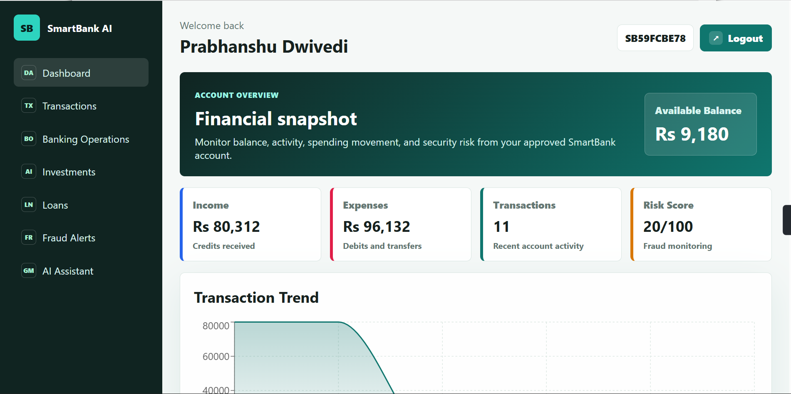

Banking Operations:

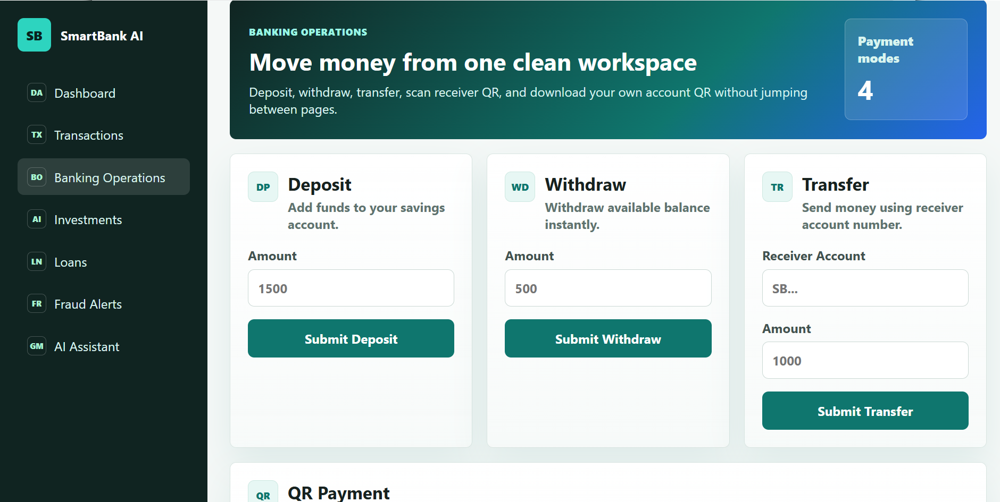

Investments:

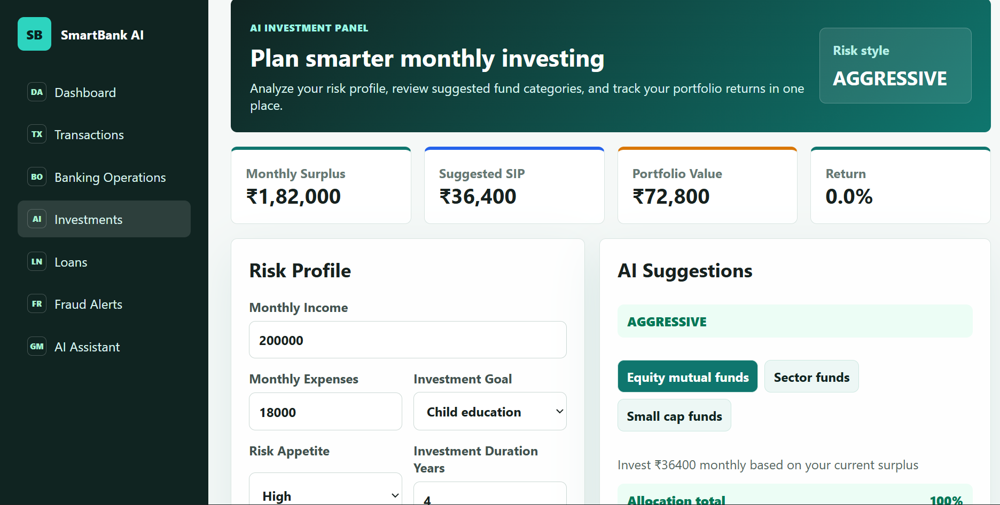

Loans:

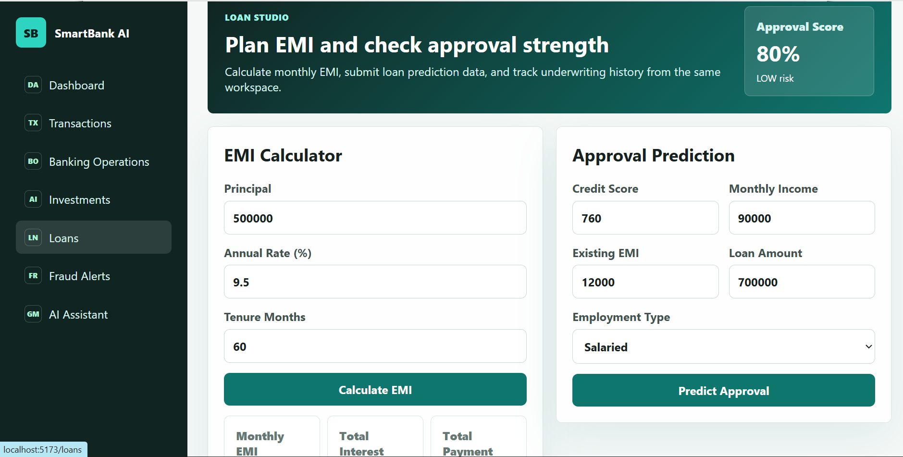

Fraud Alerts:

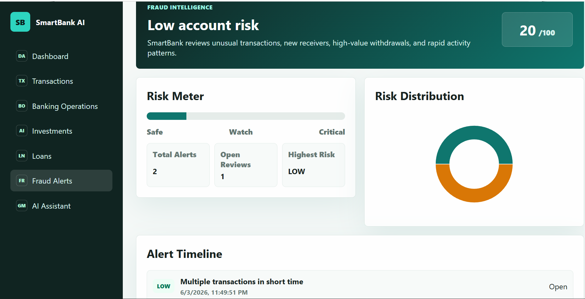

Banking Operations Alternate:


Transactions:

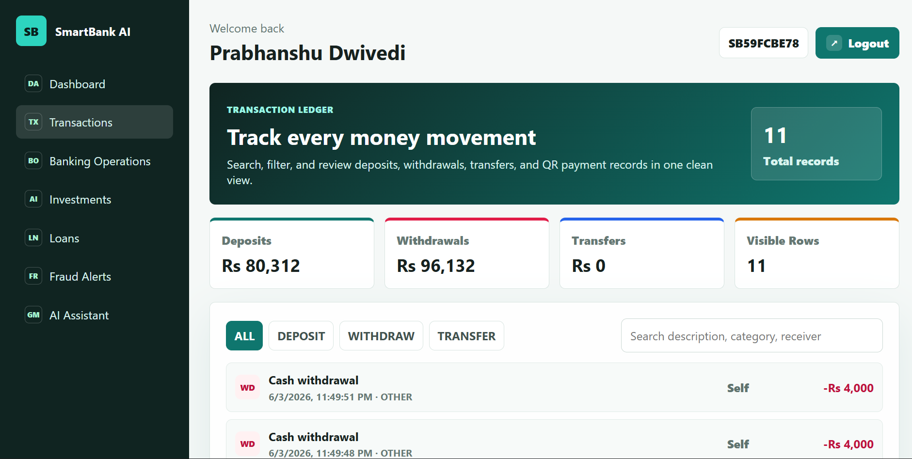

### Admin Pages

Admin Analytics:

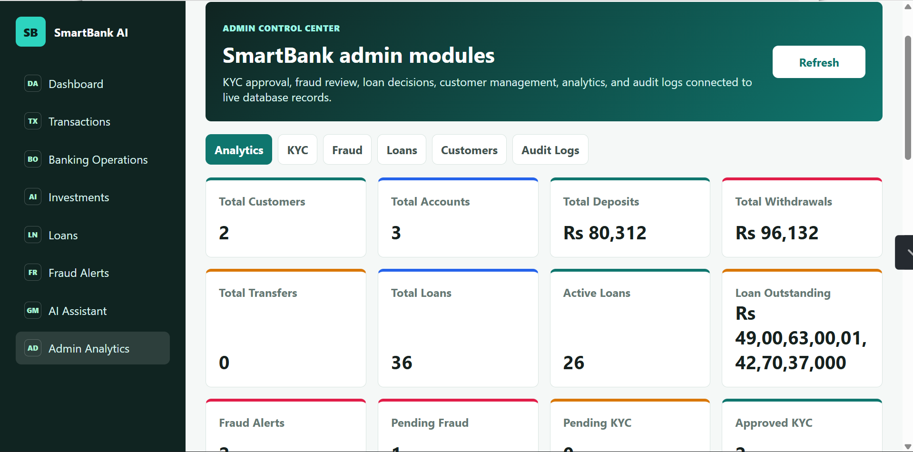

Admin Charts:

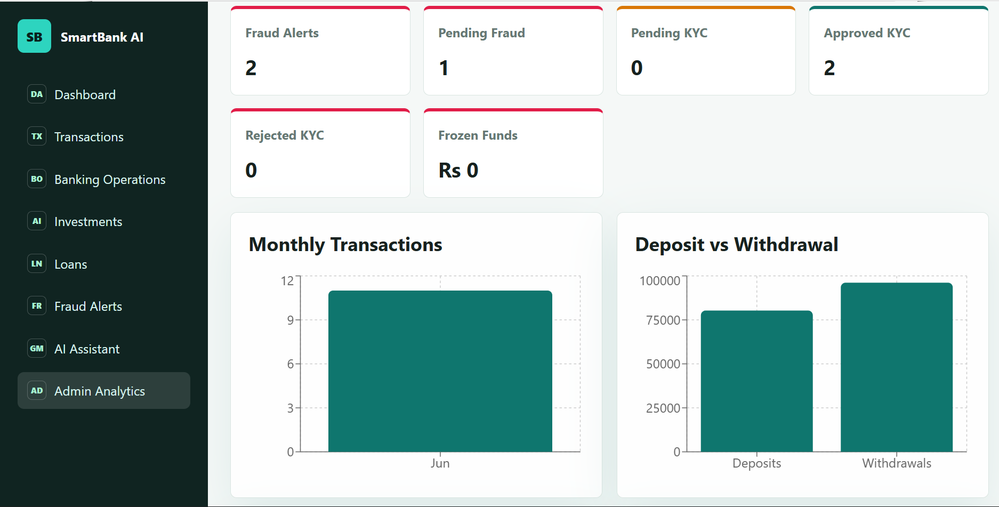

KYC Approval:

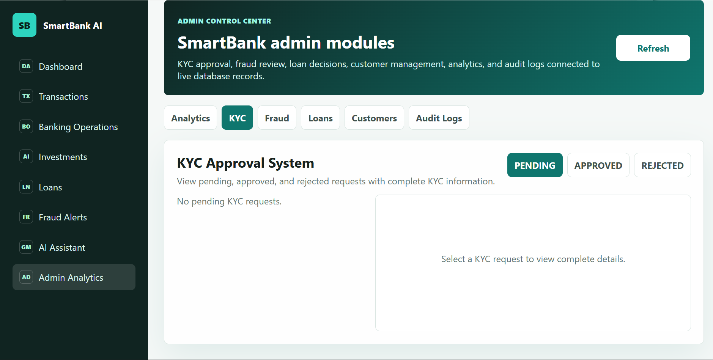

Fraud Review:

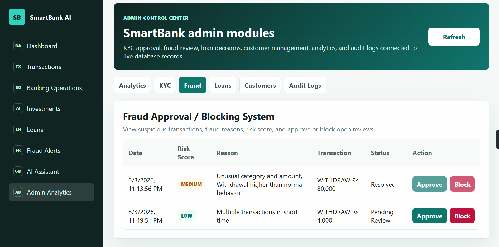

Loan Review:

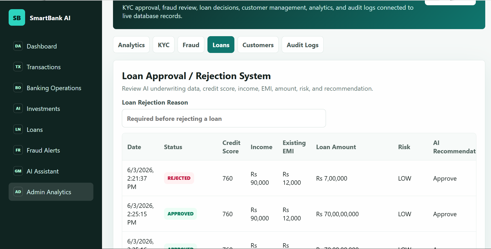

Customer Management:

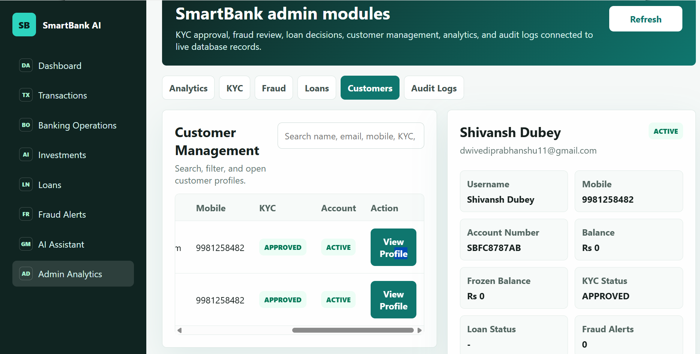

Audit Logs:

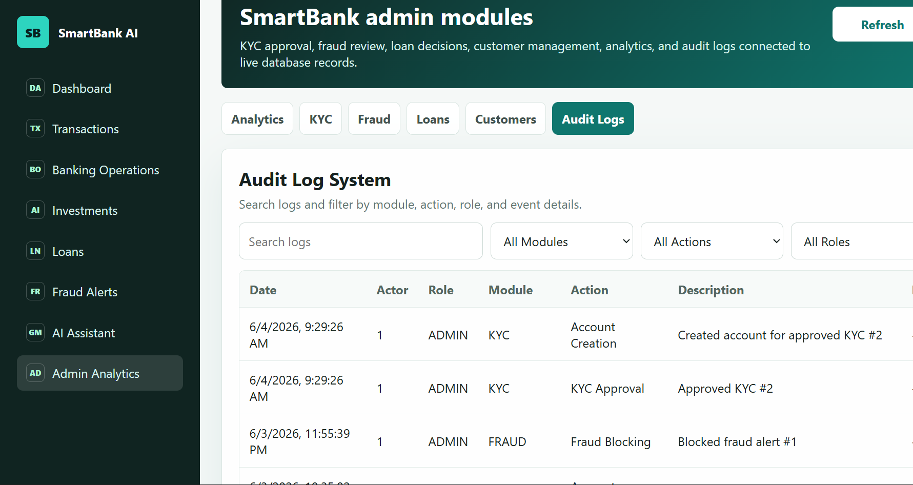

## Notes

- Run backend first, then frontend.
- Keep MySQL running before backend start.
- If frontend shows Network Error, check backend URL `http://localhost:8099/api`.
- If port `8099` is busy, stop old Java backend process.
- If OTP does not arrive quickly, check spam and backend terminal fallback OTP.
